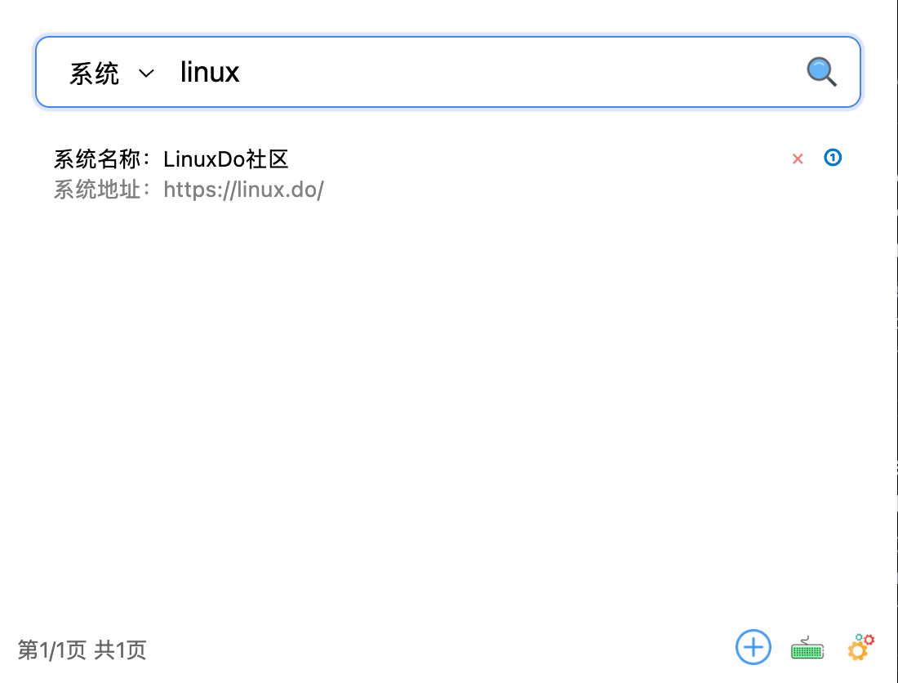
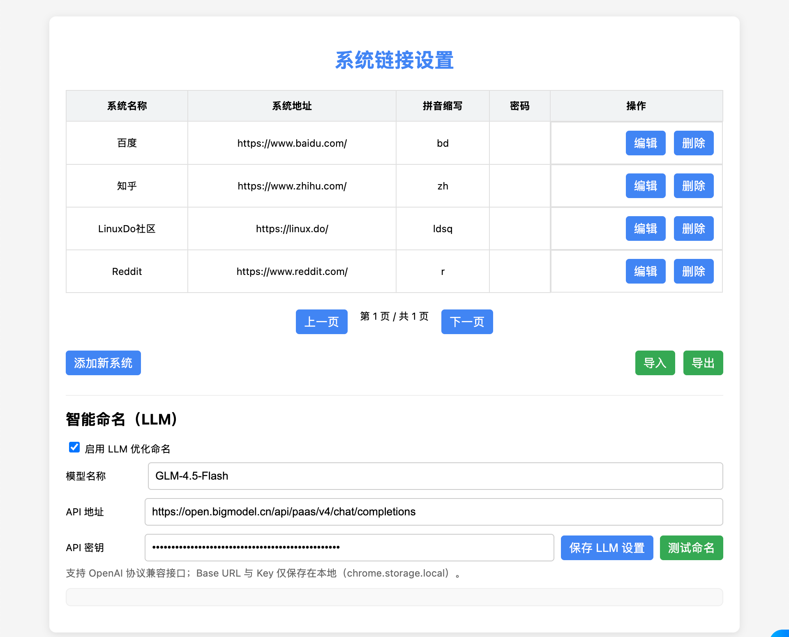
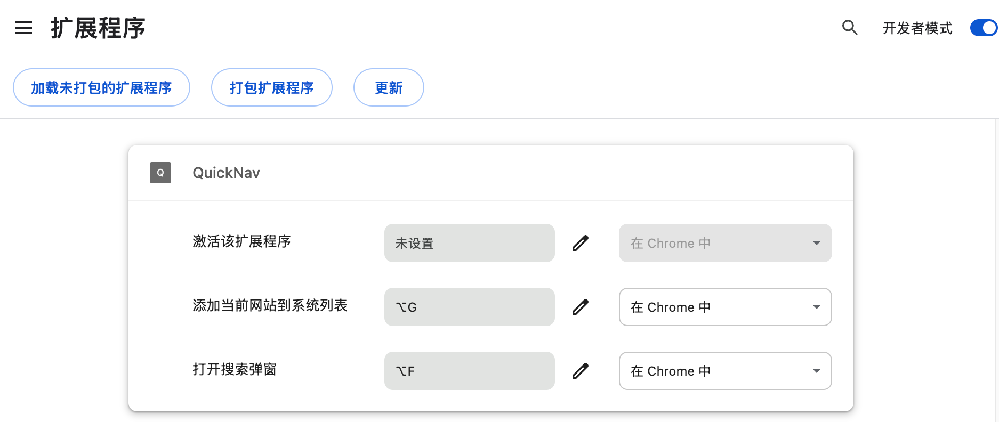

# QuickNav - 快捷导航

<div align="center">


**Your Universal Web Navigator**

一键直达任何网页 - 强大的Chrome扩展，支持自定义网站、书签、标签页和历史记录的智能搜索与快速访问。

[English](./README_EN.md) | 简体中文

</div>

## 📸 预览截图

<table>
  <tr>
    <td align="center">
      
      <br/>
      <b>插件主界面</b>
    </td>
    <td align="center">
      
      <br/>
      <b>搜索结果展示</b>
    </td>
  </tr>
  <tr>
    <td align="center">
      
      <br/>
      <b>拼音搜索演示</b>
    </td>
    <td align="center">
      
      <br/>
      <b>书签内容搜索</b>
    </td>
  </tr>
  <tr>
    <td align="center">
      
      <br/>
      <b>系统设置界面</b>
    </td>
    <td align="center">
      
      <br/>
      <b>快捷键设置</b>
    </td>
  </tr>
</table>

## 主要特性

- 🚀 快速访问：通过快捷键（Alt+Shift+K / Mac: Option+Shift+K）快速唤起搜索界面
- 🔍 智能搜索：支持系统名称和拼音缩写搜索，Tab键快速切换搜索源
- 🧠 智能记忆：自动记录搜索习惯，下次输入相同关键词自动跳转到最常用的搜索类型（系统/书签/标签/历史）
- 📑 多源搜索：支持搜索系统、书签、标签页和历史记录
- ➕ 快速添加：一键添加当前网站（Alt+Shift+S / Mac: Option+Shift+S）或点击界面"+"按钮
- 🗑️ 便捷管理：直观的系统删除和确认机制
- 💡 智能提示：操作反馈清晰，使用体验流畅
- 🎯 精准定位：支持键盘导航和快速跳转，数字键1-5快速选择结果
- 📄 分页展示：搜索结果默认每页显示5条，左右键切换分页
- 🔐 密码便捷：为系统可选配置密码，打开系统时自动复制到剪贴板

## 安装说明

1. 下载项目代码
2. 打开Chrome浏览器，进入扩展管理页面（chrome://extensions/）
3. 开启"开发者模式"
4. 点击"加载已解压的扩展程序"
5. 选择项目目录即可完成安装

## 使用指南

### 基本操作

1. 快速访问
   - 通过以下方式唤起插件：  
      - 在浏览器右上角点击插件图标唤起搜索界面
      - 按下 Alt+Shift+K（Windows/Linux）或 Option+Shift+K（Mac）唤起搜索界面
   - 输入系统名称或拼音缩写进行搜索
   - 搜索结果默认显示前5条，可通过左右键切换分页
   - 使用方向键选择结果，或按数字键1-5快速选中对应项，Enter键打开选中项

2. 添加系统
   - 访问想要添加的网站
   - 按快捷键 Alt+Shift+S（Mac: Option+Shift+S）快速添加
   - 或者打开插件，点击左下角"+"按钮添加当前网站
   - 系统会自动获取网站标题和URL，并生成拼音缩写

3. 删除系统
   - 在搜索结果中找到要删除的系统
   - 点击右侧"×"图标
   - 在确认对话框中确认删除

4. 界面功能按钮
   - **右下角按钮**：提供快捷操作入口
     - 添加网站：快速添加当前浏览的网站
     - 快捷键设置：自定义插件的快捷键组合
     - 系统设置：配置插件的高级选项（LLM智能命名、导入导出等）

### 搜索模式

插件支持四种搜索模式，可以通过下拉菜单选择或按Tab键快速切换：

- **系统**：搜索已添加的业务系统
- **书签**：搜索浏览器书签
- **标签**：搜索当前打开的标签页
- **历史**：搜索浏览历史记录

**智能记忆功能**：插件会自动记录你在不同搜索模式下选择的结果。当你下次输入相同的关键词时，会自动切换到你最常使用的搜索类型。例如：
- 如果你经常搜索"github"并选择书签中的结果，下次输入"github"时会自动切换到书签模式
- 如果你经常搜索"jira"并选择系统列表中的结果，下次输入"jira"时会自动切换到系统模式

### 键盘快捷键

- **Alt+Shift+K**（Windows/Linux） / **Option+Shift+K**（Mac）：打开搜索界面
- **Alt+Shift+S** / **Option+Shift+S**：添加当前网站到系统列表
- **↑/↓**：在搜索结果中导航
- **←/→**：切换搜索结果分页
- **1/2/3/4/5**：快速选中对应序号的搜索结果
- **Enter**：打开选中的项目
- **Tab**：切换搜索模式（系统/书签/标签/历史）
- **Esc**：关闭搜索界面

## 项目结构

```
my-chrome-extension/
├── manifest.json        # 扩展配置文件
├── popup.html          # 弹出窗口界面
├── popup.js           # 弹出窗口逻辑
├── content.js         # 内容脚本
├── background.js      # 后台脚本
├── systemsManager.js  # 系统管理器
├── searchStats.js     # 搜索统计
├── styles.css         # 样式文件
└── images/           # 图标资源
    ├── add.png
    ├── keyboard.png
    ├── search.png
    └── setting.png
```

## 技术特性

- 原生JavaScript实现，无需额外依赖
- 支持中文拼音搜索
- 本地存储系统数据
- 实时搜索和过滤
- 优化的UI渲染性能
- 完善的错误处理机制

## ⚙️ 高级配置

### LLM智能命名

插件支持集成大语言模型来优化系统名称：

1. 打开设置页面
2. 启用"LLM优化命名"选项
3. 配置以下参数：
   - **模型名称**：如 `GLM-4.5-Flash`、`gpt-4o-mini` 等
   - **API地址**：OpenAI兼容的Chat Completions接口
   - **API密钥**：你的API Key（仅存储在本地）
4. 点击"测试命名"验证配置

**支持的LLM提供商**：
- 智谱AI（GLM系列）
- OpenAI（GPT系列）
- 其他兼容OpenAI协议的服务

## ⚠️ 注意事项

1. **权限说明**：首次使用需要授予以下权限
   - 标签页访问权限（切换和添加标签）
   - 书签访问权限（搜索书签）
   - 历史记录访问权限（搜索历史）
   - 剪贴板写入权限（复制密码）

2. **数据存储**：系统数据存储在本地（localStorage + chrome.storage），清除浏览器数据可能会影响已保存的系统列表

3. **性能优化**：搜索结果默认每页显示5条，使用左右箭头键翻页

4. **隐私保护**：所有数据仅保存在本地，不会上传到任何服务器（LLM功能除外，需要调用配置的API）

## ❓ 常见问题 (FAQ)

<details>
<summary><b>Q: 为什么快捷键不生效？</b></summary>

A: 请检查：
1. 访问 `chrome://extensions/shortcuts` 确认快捷键是否被其他扩展占用
2. 某些Chrome特殊页面（如chrome://、edge://）不支持内容脚本注入
3. 尝试重新加载扩展程序
</details>

<details>
<summary><b>Q: 如何备份我的系统列表？</b></summary>

A: 打开设置页面，点击"导出"按钮即可将系统列表保存为JSON文件。恢复时点击"导入"选择该文件即可。
</details>

<details>
<summary><b>Q: LLM功能需要付费吗？</b></summary>

A: LLM功能是可选的，需要你自己申请API密钥。不同提供商有不同的定价策略，大多数提供免费额度。不启用LLM时，插件会使用本地拼音规则生成缩写。
</details>

<details>
<summary><b>Q: 支持同步到其他设备吗？</b></summary>

A: 当前版本暂不支持云端同步，但你可以通过"导出/导入"功能手动同步数据。未来版本可能会添加云同步功能。
</details>

<details>
<summary><b>Q: 如何修改已添加的系统信息？</b></summary>

A: 打开设置页面，在系统列表中直接修改对应行的信息，修改后会自动保存。
</details>

## 🔒 隐私政策

- ✅ 所有数据仅存储在本地浏览器中
- ✅ 不收集任何用户信息
- ✅ 不向第三方发送数据（LLM功能除外，且需用户主动配置）
- ✅ 开源透明，代码可审计

## 📄 许可证

本项目采用 [MIT License](./LICENSE) 开源许可证。

---

<div align="center">

如果这个项目对你有帮助，请给它一个 ⭐️ Star！

Made with ❤️ by QuickNav Contributors

</div> 
