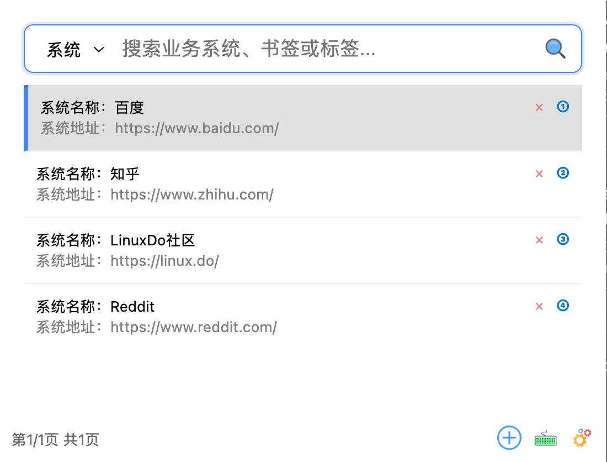
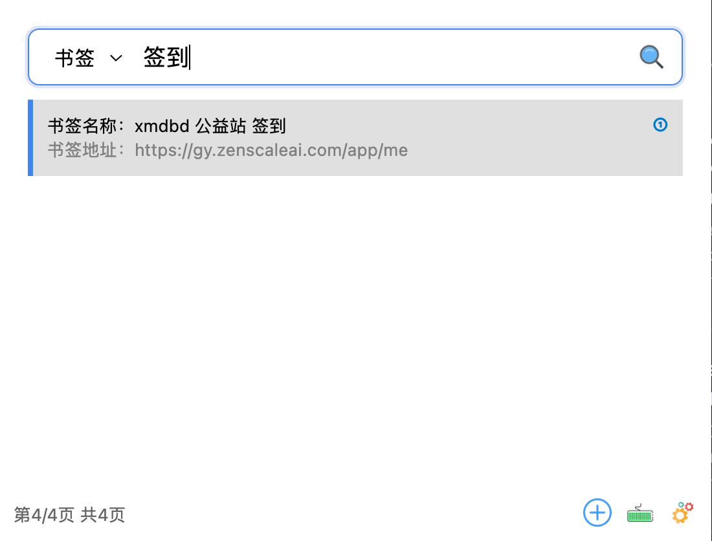
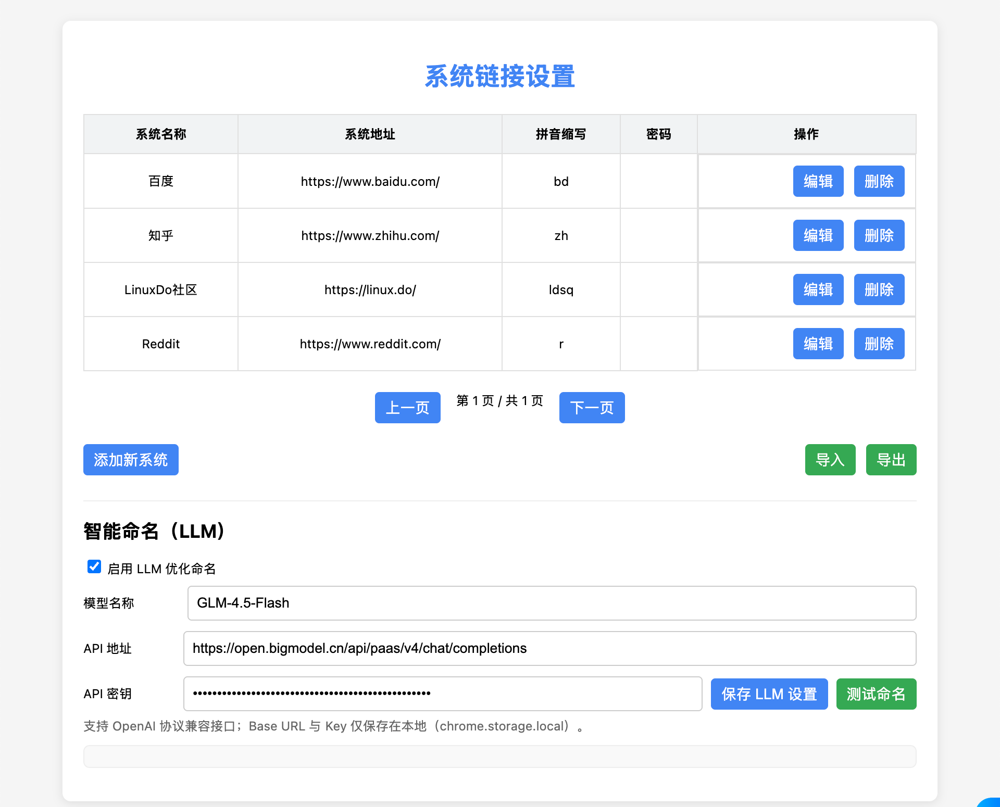
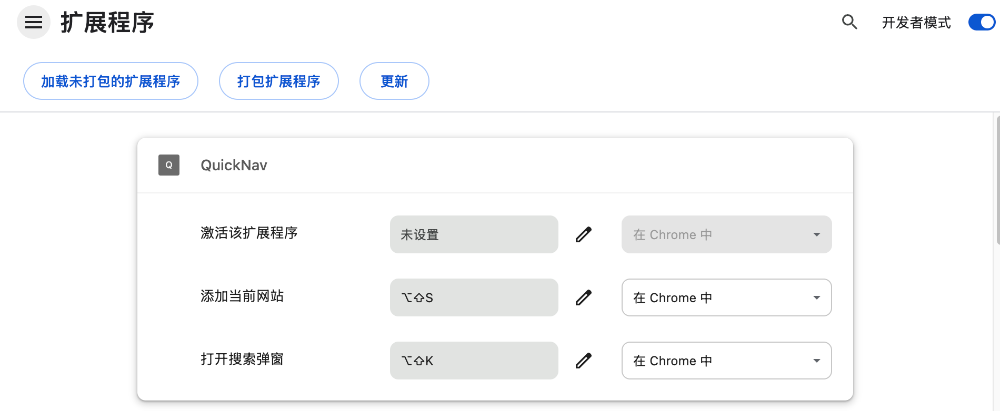

# QuickNav - Your Universal Web Navigator

<div align="center">


**Your Universal Web Navigator**

One-click access to any webpage - A powerful Chrome extension for smart search and quick access to custom websites, bookmarks, tabs, and browsing history.

English | [简体中文](./README.md)

</div>

## 📸 Screenshots

<table>
  <tr>
    <td align="center">
      
      <br/>
      <b>Main Interface</b>
    </td>
    <td align="center">
      
      <br/>
      <b>Search Results</b>
    </td>
  </tr>
  <tr>
    <td align="center">
      
      <br/>
      <b>Pinyin Search Demo</b>
    </td>
    <td align="center">
      
      <br/>
      <b>Bookmark Search</b>
    </td>
  </tr>
  <tr>
    <td align="center">
      
      <br/>
      <b>Settings Interface</b>
    </td>
    <td align="center">
      
      <br/>
      <b>Keyboard Shortcuts</b>
    </td>
  </tr>
</table>

## Key Features

- 🚀 Quick Access: Quickly open search interface with hotkey (Alt+Shift+K / Mac: Option+Shift+K)
- 🔍 Smart Search: Support system name and pinyin abbreviation search, Tab key to quickly switch search sources
- 🧠 Smart Memory: Automatically remembers your search habits and switches to your most-used search type (Systems/Bookmarks/Tabs/History) for the same keyword
- 📑 Multi-Source Search: Search systems, bookmarks, tabs, and history
- ➕ Quick Add: One-click add current website (Alt+Shift+S / Mac: Option+Shift+S) or click the "+" button
- 🗑️ Easy Management: Intuitive system deletion with confirmation mechanism
- 💡 Smart Hints: Clear operation feedback for smooth experience
- 🎯 Precise Navigation: Keyboard navigation and quick jump support, number keys 1-5 for quick selection
- 📄 Pagination: Search results display 5 items per page by default, use left/right keys to switch pages
- 🔐 Password Convenience: Optional password field, auto-copy to clipboard when opening
- 🕹 Single Hotkey Mode (optional): Double-press the main hotkey to "Add current website"; single press opens the search after an adjustable delay (default 380ms, adjustable in Settings)
- ⌨️ Shortcuts Status Panel: See current bindings in Settings and jump to Chrome’s shortcuts page to resolve conflicts

## Installation

1. Download the project code
2. Open Chrome browser, go to extensions page (chrome://extensions/)
3. Enable "Developer mode"
4. Click "Load unpacked"
5. Select the project directory to complete installation

## Usage Guide

### Basic Operations

1. **Quick Access**
   - Access the plugin by:
     - Click the plugin icon in the browser toolbar to open search interface
     - Press Alt+Shift+K (Windows/Linux) or Option+Shift+K (Mac) to open search interface
   - Enter system name or pinyin abbreviation to search
   - Search results display the first 5 items by default, use left/right keys to switch pages
   - Use arrow keys to select results, or press number keys 1-5 to quickly select corresponding items, press Enter to open selected item

2. **Add System**
   - Visit the website you want to add
   - Press hotkey Alt+Shift+S (Mac: Option+Shift+S) for quick add
   - Or open the plugin and click the "+" button in the lower left corner to add current website
   - The system will automatically get the website title and URL, and generate pinyin abbreviation

3. **Delete System**
   - Find the system you want to delete in the search results
   - Click the "×" icon on the right
   - Confirm deletion in the confirmation dialog

4. **Interface Buttons**
   - **Lower right corner buttons**: Provide quick operation shortcuts
     - Add Website: Quickly add the current browsing website
     - Keyboard Shortcuts: Customize plugin keyboard shortcuts
     - Settings: Configure plugin advanced options (LLM smart naming, import/export, etc.)

5. **Single Hotkey Mode (optional)**
   - Open Settings → check "Enable Single Hotkey Mode"
   - Single press the main hotkey: open the search after a short delay (default 380ms)
   - Double press the main hotkey (press again within the delay): directly "Add current website" without opening the UI
   - Adjust delay with the slider in Settings (200–800ms, step 20ms)

### Search Modes

The plugin supports four search modes, switchable via dropdown menu or Tab key:

- **Systems**: Search added business systems
- **Bookmarks**: Search browser bookmarks
- **Tabs**: Search currently open tabs
- **History**: Search browsing history

**Smart Memory Feature**: The extension automatically tracks which results you select in different search modes. When you type the same keyword again, it will automatically switch to your most frequently used search type. For example:
- If you often search for "github" and select results from bookmarks, next time you type "github" it will automatically switch to bookmarks mode
- If you often search for "jira" and select results from the systems list, next time you type "jira" it will automatically switch to systems mode

### Keyboard Shortcuts

- **Alt+Shift+K** (Windows/Linux) / **Option+Shift+K** (Mac): Open search interface
- **Alt+Shift+S** / **Option+Shift+S**: Add current website to system list
- (Optional) Single Hotkey Mode: Double-press the main hotkey to add current website; default 380ms, adjustable in Settings
- (Tip) If Alt/Option+Shift conflicts with your OS/IME, consider Windows/Linux: `Ctrl+Shift+K` / `Ctrl+Shift+Y`; macOS: `Command+Option+K` / `Command+Option+S`
- **↑/↓**: Navigate through search results
- **←/→**: Switch search result pages
- **1/2/3/4/5**: Quickly select search result by number
- **Enter**: Open selected item
- **Tab**: Switch search mode (Systems/Bookmarks/Tabs/History)
- **Esc**: Close search interface

## Project Structure

```
my-chrome-extension/
├── manifest.json        # Extension configuration
├── popup.html          # Popup window UI
├── popup.js           # Popup window logic
├── content.js         # Content script
├── background.js      # Background script
├── systemsManager.js  # System manager
├── searchStats.js     # Search statistics
├── styles.css         # Stylesheet
└── images/           # Icon resources
    ├── add.png
    ├── keyboard.png
    ├── search.png
    └── setting.png
```

## Technical Features

- Native JavaScript implementation, no external dependencies
- Support Chinese pinyin search
- Local storage of system data
- Real-time search and filtering
- Optimized UI rendering performance
- Comprehensive error handling mechanism

## ⚙️ Advanced Configuration

### LLM Smart Naming

The plugin supports integrating large language models to optimize system names:

1. Open the settings page
2. Enable "LLM optimization naming" option
3. Configure the following parameters:
   - **Model Name**: e.g., `GLM-4.5-Flash`, `gpt-4o-mini`, etc.
   - **API URL**: OpenAI-compatible Chat Completions interface
   - **API Key**: Your API Key (stored locally only)
4. Click "Test Naming" to verify configuration

**Supported LLM Providers**:
- Zhipu AI (GLM series)
- OpenAI (GPT series)
- Other OpenAI protocol-compatible services

### Single Hotkey Mode & Double-Press Delay

1. Open the Settings page → enable "Single Hotkey Mode"
2. Behavior:
   - Single press: open search after a short delay
   - Double press: directly add current website
3. Adjust the double-press detection delay with the slider: 200–800ms, default 380ms (step 20ms)
4. The "Shortcuts Status" panel shows actual bindings and a quick link to `chrome://extensions/shortcuts`

## ⚠️ Notes

1. **Permissions**: First-time use requires granting the following permissions
   - Tab access (for switching and adding tabs)
   - Bookmark access (for searching bookmarks)
   - History access (for searching history)
   - Clipboard write (for copying passwords)

2. **Data Storage**: System data is stored locally (localStorage + chrome.storage), clearing browser data may affect saved system list

3. **Performance Optimization**: Search results display 5 items per page by default, use left/right arrow keys to paginate

4. **Privacy Protection**: All data is saved locally only, not uploaded to any server (except LLM feature, which requires configured API)

## ❓ FAQ

<details>
<summary><b>Q: Why don't hotkeys work?</b></summary>

A: Please check:
1. Visit `chrome://extensions/shortcuts` to confirm hotkeys are not occupied by other extensions
2. Some Chrome special pages (like chrome://, edge://) don't support content script injection
3. Try reloading the extension
</details>

<details>
<summary><b>Q: How to backup my system list?</b></summary>

A: Open the settings page and click the "Export" button to save the system list as a JSON file. To restore, click "Import" and select the file.
</details>

<details>
<summary><b>Q: Is the LLM feature paid?</b></summary>

A: The LLM feature is optional and requires you to apply for an API key yourself. Different providers have different pricing policies, most offer free quotas. Without LLM enabled, the plugin uses local pinyin rules to generate abbreviations.
</details>

<details>
<summary><b>Q: Does it support sync to other devices?</b></summary>

A: The current version doesn't support cloud sync, but you can manually sync data via "Export/Import" feature. Future versions may add cloud sync functionality.
</details>

<details>
<summary><b>Q: How to modify added system information?</b></summary>

A: Open the settings page, directly modify the information in the corresponding row of the system list, changes are auto-saved.
</details>

## 🔒 Privacy Policy

- ✅ All data is stored locally in the browser only
- ✅ No user information collected
- ✅ No data sent to third parties (except LLM feature, which requires user configuration)
- ✅ Open source and transparent, code is auditable

## 📄 License

This project is licensed under the [MIT License](./LICENSE).

---

<div align="center">

If this project helps you, please give it a ⭐️ Star!

Made with ❤️ by QuickNav Contributors

</div>
